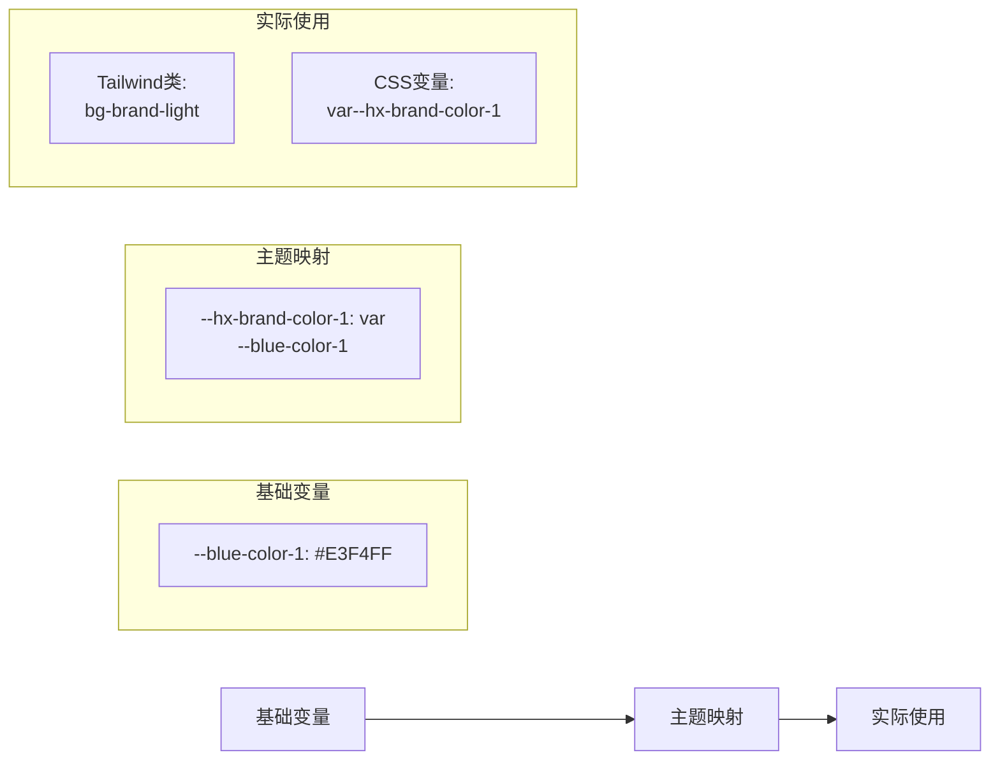
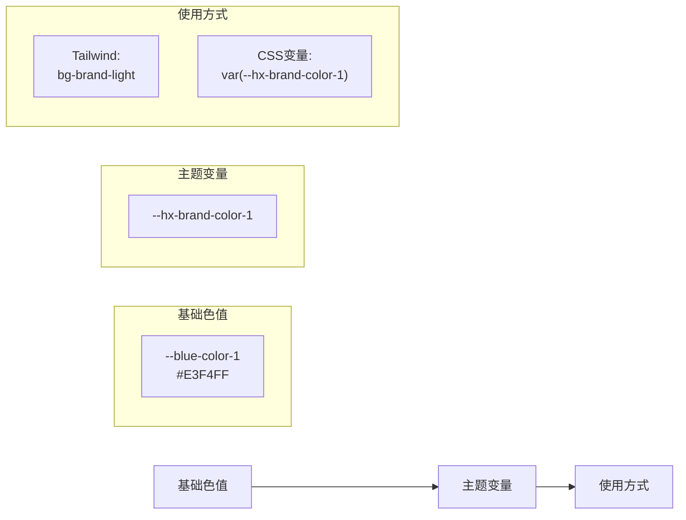
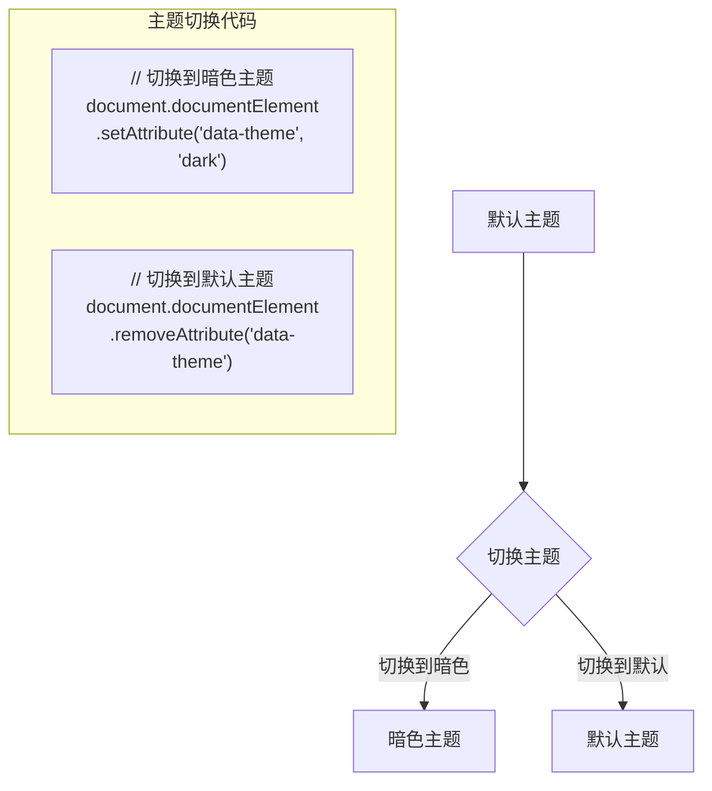

# 基于Vue2的UI项目开发指南

本文档提供了基于Vue2架构搭建项目的详细指南，所有样式基于UItoken.md文件定义的标准实现。

## 目录

- [基础架构](#基础架构)
- [环境依赖](#环境依赖)
- [样式系统](#样式系统)
- [项目搭建流程](#项目搭建流程)
- [外部组件样式适配](#外部组件样式适配)
- [ECharts图表集成](#echarts图表集成)
- [样式系统使用流程](#样式系统使用流程)
- [UIToken规范指南](#UIToken规范指南)

## 基础架构

项目整体架构如下：

- **前端框架**：Vue2
- **构建工具**：Vue CLI 4
- **样式方案**：CSS变量 + SCSS + Tailwind CSS (按需定制)
- **组件库**：Element UI (可选)
- **图表库**：ECharts

## 环境依赖

为确保与Vue2兼容，推荐使用以下版本的依赖：

### 核心依赖

```bash
# Vue2最新稳定版本
vue@2.7.14

# Vue CLI
@vue/cli@4.5.19

# Vue CLI服务
@vue/cli-service@4.5.19
```

### 样式相关依赖

```bash
# SCSS支持
sass@1.32.13
sass-loader@10.4.1
```

### Tailwind CSS相关依赖

```bash
# Tailwind CSS (与Vue2兼容的版本)
tailwindcss@3.3.3
postcss@8.4.24
autoprefixer@10.4.14
postcss-loader@4.3.0
```

### Element UI

```bash
# Element UI for Vue2
element-ui@2.15.14
```

### package.json 示例

```json
"dependencies": {
  "core-js": "^3.8.3",
  "element-ui": "^2.15.14",
  "vue": "^2.7.14"
},
"devDependencies": {
  "@vue/cli-plugin-babel": "~4.5.19",
  "@vue/cli-service": "~4.5.19",
  "autoprefixer": "^10.4.14",
  "postcss": "^8.4.24",
  "postcss-loader": "^4.3.0",
  "sass": "^1.32.13",
  "sass-loader": "^10.4.1",
  "tailwindcss": "^3.3.3",
  "vue-template-compiler": "^2.7.14"
}
```

## 样式系统

采用三层架构设计的样式系统，实现主题可定制、样式统一：

### 1. 基础层（不随主题变化）

包含所有原始值的定义，如色阶、字体大小、间距值等

```scss
/* 基础色板示例 src/styles/tokens/base-colors.scss */
:root {
  /* 基础色板 - 永远不变 */
  --blue-color-1: #E3F4FF;
  --blue-color-2: #C0E6FD;
  --blue-color-3: #80CAFF;
  /* ...其他基础色 */
}
```

### 2. 映射层（随主题变化）

将业务名称映射到基础层的具体项，不同主题下映射关系可变

```scss
/* 默认主题映射 src/styles/themes/default-theme.scss */
:root {
  /* 业务色映射 - 可随主题变化 */
  --hx-brand-color-1: var(--blue-color-1);
  --hx-brand-color-2: var(--blue-color-2);
  /* ...其他业务色映射 */
}

/* 暗黑主题映射 src/styles/themes/dark-theme.scss */
:root[data-theme="dark"] {
  --hx-brand-color-1: var(--blue-color-4);
  --hx-brand-color-2: var(--blue-color-5);
  /* ...其他暗黑主题业务色映射 */
}
```

### 3. 应用层

在组件中使用映射层的业务名称，而不直接使用基础层变量

```scss
.button {
  background-color: var(--hx-brand-color-3);
  color: var(--hx-gray-color-1);
  /* ...其他样式 */
}
```

## 项目搭建流程

### 第一步：创建Vue2项目

```bash
# 安装Vue CLI（如果尚未安装）
npm install -g @vue/cli

# 创建新项目，指定Vue2版本
vue create ui-project --preset vue2

# 进入项目目录
cd ui-project
```

### 第二步：安装必要的依赖

```bash
# 安装SCSS支持
npm install sass@1.32.13 sass-loader@10.4.1 -D

# 安装Tailwind CSS（可选）
npm install tailwindcss@3.3.3 postcss@8.4.24 autoprefixer@10.4.14 postcss-loader@4.3.0 -D

# 如果需要Element UI（可选）
npm install element-ui@2.15.14
```

### 第三步：创建样式系统目录结构

```bash
mkdir -p src/styles/tokens
mkdir -p src/styles/themes
```

### 第四步：建立样式文件

1. 基础层文件：
   - `src/styles/tokens/base-colors.scss`
   - `src/styles/tokens/base-fonts.scss`
   - `src/styles/tokens/base-spacing.scss`
   - `src/styles/tokens/base-radius.scss`

2. 映射层文件：
   - `src/styles/themes/default-theme.scss`
   - `src/styles/themes/dark-theme.scss`

3. 主样式文件：
   - `src/styles/index.scss`

### 第五步：主题切换功能

```javascript
// src/utils/themeUtils.js

// 切换主题
export const switchTheme = (theme) => {
  document.documentElement.setAttribute('data-theme', theme);
  localStorage.setItem('app-theme', theme);
};

// 初始化主题
export const initTheme = () => {
  const savedTheme = localStorage.getItem('app-theme');
  if (savedTheme) {
    switchTheme(savedTheme);
  } else {
    const prefersDark = window.matchMedia('(prefers-color-scheme: dark)').matches;
    switchTheme(prefersDark ? 'dark' : 'default');
  }
};
```

### 第六步：创建辅助函数

```javascript
// src/utils/styleUtils.js
export const getCSSVar = (varName) => {
  const name = varName.startsWith('--') ? varName : `--${varName}`;
  return getComputedStyle(document.documentElement).getPropertyValue(name).trim();
};
```

## 外部组件样式适配

外部组件可以通过以下方式应用自定义UI样式：

### 方法一：全局覆盖组件库样式

```scss
/* src/styles/element-override.scss */
.el-button--primary {
  background-color: var(--hx-brand-color-3);
  border-color: var(--hx-brand-color-3);
  
  &:hover, &:focus {
    background-color: var(--hx-brand-color-2);
    border-color: var(--hx-brand-color-2);
  }
  
  /* ...其他状态 */
}
```

### 方法二：组件局部样式覆盖

```vue
<style lang="scss" scoped>
.custom-form {
  /* 使用 ::v-deep 深度选择器覆盖子组件样式 */
  ::v-deep .el-input__inner {
    height: calc(var(--hx-comp-size-m) - 2px);
    border-radius: var(--hx-radius-default);
    /* ...其他样式 */
  }
}
</style>
```

### 方法三：创建样式包装器组件

```vue
<!-- src/components/ui/StyledButton.vue -->
<template>
  <el-button 
    :type="type" 
    :size="size" 
    :disabled="disabled"
    v-bind="$attrs" 
    v-on="$listeners"
  >
    <slot></slot>
  </el-button>
</template>

<script>
export default {
  name: 'StyledButton',
  inheritAttrs: false,
  props: {
    type: String,
    size: String,
    disabled: Boolean
  }
}
</script>

<style lang="scss" scoped>
::v-deep .el-button {
  &.el-button--primary {
    background-color: var(--hx-brand-color-3);
    /* ...其他样式 */
  }
  /* ...其他类型的按钮 */
}
</style>
```

## ECharts图表集成

### 1. 创建图表主题适配器

```javascript
// src/utils/chartTheme.js
import { getCSSVar } from './styleUtils';

// 创建与UI系统匹配的ECharts主题
export const createChartTheme = () => {
  return {
    // 颜色系列
    color: [
      getCSSVar('hx-brand-color-3'),
      getCSSVar('hx-sec-brand-color-3'),
      getCSSVar('hx-success-color-3'),
      getCSSVar('hx-warning-color-3'),
      getCSSVar('hx-danger-color-3')
    ],
    
    // 背景色
    backgroundColor: getCSSVar('hx-bg-color-container'),
    
    // 全局文字样式
    textStyle: {
      color: getCSSVar('hx-font-color-1')
    },
    
    // 坐标轴
    xAxis: {
      axisLine: {
        lineStyle: {
          color: getCSSVar('hx-border-level-2-color')
        }
      },
      axisLabel: {
        color: getCSSVar('hx-font-color-2')
      }
    },
    
    yAxis: {
      axisLine: {
        lineStyle: {
          color: getCSSVar('hx-border-level-2-color')
        }
      },
      axisLabel: {
        color: getCSSVar('hx-font-color-2')
      }
    },
    
    // 提示框
    tooltip: {
      backgroundColor: getCSSVar('hx-bg-color-container'),
      borderColor: getCSSVar('hx-border-level-3-color'),
      textStyle: {
        color: getCSSVar('hx-font-color-1')
      }
    }
    
    // ...其他样式配置
  };
};

// 注册主题到ECharts
export const registerTheme = (echarts) => {
  echarts.registerTheme('hxTheme', createChartTheme());
};
```

### 2. 创建响应式ECharts组件

```vue
<!-- src/components/charts/BaseChart.vue -->
<template>
  <div class="chart-container" :style="containerStyle">
    <div class="chart-title" v-if="title">{{ title }}</div>
    <div ref="chartRef" class="chart-instance" :style="chartStyle"></div>
  </div>
</template>

<script>
import * as echarts from 'echarts';
import { createChartTheme, registerTheme } from '@/utils/chartTheme';

export default {
  name: 'BaseChart',
  props: {
    title: String,
    options: Object,
    height: {
      type: String,
      default: '400px'
    },
    width: {
      type: String,
      default: '100%'
    }
  },
  data() {
    return {
      chart: null
    };
  },
  mounted() {
    this.initChart();
    
    // 监听主题变化
    this.observer = new MutationObserver(() => {
      this.updateChartTheme();
    });
    
    this.observer.observe(document.documentElement, {
      attributes: true,
      attributeFilter: ['data-theme']
    });
  },
  methods: {
    initChart() {
      // 注册主题到ECharts
      registerTheme(echarts);
      
      // 初始化图表实例
      this.chart = echarts.init(this.$refs.chartRef, 'hxTheme');
      
      if (this.options) {
        this.chart.setOption(this.options);
      }
      
      this.$emit('ready', this.chart);
    },
    updateChartTheme() {
      if (!this.chart) return;
      
      const theme = createChartTheme();
      const themeOptions = {
        color: theme.color,
        backgroundColor: theme.backgroundColor,
        textStyle: theme.textStyle
      };
      
      this.chart.setOption(themeOptions);
    }
  },
  watch: {
    options: {
      handler(newOptions) {
        if (this.chart && newOptions) {
          this.chart.setOption(newOptions, true);
        }
      },
      deep: true
    }
  },
  beforeDestroy() {
    if (this.chart) {
      this.chart.dispose();
    }
    if (this.observer) {
      this.observer.disconnect();
    }
  }
}
</script>
```

### 3. 图表使用示例

```vue
<template>
  <base-chart 
    title="月度销售数据" 
    :options="barOptions" 
    height="350px"
  />
</template>

<script>
import BaseChart from '@/components/charts/BaseChart.vue';
import { getCSSVar } from '@/utils/styleUtils';

export default {
  components: {
    BaseChart
  },
  data() {
    return {
      barOptions: {
        tooltip: {
          trigger: 'axis'
        },
        xAxis: {
          type: 'category',
          data: ['一月', '二月', '三月', '四月', '五月', '六月']
        },
        yAxis: {
          type: 'value'
        },
        series: [
          {
            name: '销售额',
            type: 'bar',
            data: [120, 132, 101, 134, 90, 230],
            // 使用业务颜色
            itemStyle: {
              color: getCSSVar('hx-brand-color-3')
            }
          }
        ]
      }
    };
  }
}
</script>
```


## 样式系统使用流程

### 样式系统架构图
```mermaid
graph TD
    A[基础层 Base Layer] --> B[映射层 Mapping Layer]
    B --> C1[Tailwind 工具类]
    B --> C2[CSS/SCSS 直接使用]
    
    subgraph 基础层
    A1[base-colors.scss] --> A
    A2[base-fonts.scss] --> A
    A3[base-spacing.scss] --> A
    A4[base-radius.scss] --> A
    end
    
    subgraph 映射层
    B1[default-theme.scss] --> B
    B2[dark-theme.scss] --> B
    end
    
    subgraph 应用层
    C1 --> D1[class='text-brand bg-brand-light p-2']
    C2 --> D2[.custom-class { color: var(--hx-brand-color-3); }]
    end
```

### 样式调用流程

1. **基础变量定义** → **主题映射** → **实际使用**


### 两种使用方式

1. **Tailwind工具类方式**：
```html
<!-- 使用Tailwind工具类 -->
<div class="bg-brand text-white p-2 rounded-default">
  按钮
</div>
```

2. **CSS变量方式**：
```scss
/* 使用CSS变量 */
.custom-button {
  background-color: var(--hx-brand-color-3);
  color: var(--hx-gray-color-1);
  padding: var(--hx-size-2);
  border-radius: var(--hx-radius-default);
}
```

### 变量映射关系图


### 主题切换流程


### 推荐使用方式

1. **纯Tailwind工具类**（推荐用于快速开发）：
```html
<button class="bg-brand text-white p-2 rounded-default hover:bg-brand-dark">
  提交
</button>
```

2. **纯CSS变量**（推荐用于自定义组件）：
```scss
.custom-component {
  background: var(--hx-brand-color-3);
  color: var(--hx-gray-color-1);
  padding: var(--hx-size-2);
  border-radius: var(--hx-radius-default);
  
  &:hover {
    background: var(--hx-brand-color-dark);
  }
}
```

3. **混合使用**（推荐用于复杂组件）：
```html
<div class="bg-brand p-2"> <!-- Tailwind工具类 -->
  <div class="custom-component"> <!-- 自定义类 -->
    内容
  </div>
</div>
```

## UI Token 规范指南

为确保开发过程中正确使用设计令牌(Design Tokens)，请遵循以下规范：

### 命名规范

UI Token遵循以下命名模式：
--[前缀]-[类别]-[属性]-[状态/变体]

例如：
- `--hx-brand-color-3`: 品牌色第3级
- `--hx-font-size-body-medium`: 正文中号字体大小
- `--hx-border-level-1-color`: 一级边框颜色

### Token类别与层次

1. **基础令牌(Foundation Tokens)**
   - 位于`src/styles/tokens/`目录
   - 直接表示原始值，不用于直接调用
   - 例：`--blue-color-1`, `--size-1`

2. **主题令牌(Theme Tokens)**
   - 位于`src/styles/themes/`目录
   - 映射基础令牌到具体业务语义
   - 例：`--hx-brand-color-1`, `--hx-text-color-primary`

3. **组件令牌(Component Tokens)**
   - 在组件中使用的特定变量
   - 基于主题令牌构建
   - 例：`.button { background: var(--hx-brand-color-3); }`

### 令牌分类

1. **颜色令牌**
   - 品牌色：`--hx-brand-color-[级别]`
   - 功能色：`--hx-success-color-[级别]`, `--hx-warning-color-[级别]`, `--hx-danger-color-[级别]`
   - 中性色：`--hx-gray-color-[级别]`
   - 文本色：`--hx-text-color-[级别]`
   - 边框色：`--hx-border-level-[级别]-color`
   - 背景色：`--hx-bg-color-[类型]`

2. **尺寸令牌**
   - 基础尺寸：`--hx-size-[级别]`
   - 组件尺寸：`--hx-comp-size-[级别]`
   - 内边距：`--hx-comp-padding[方向]-[级别]`
   - 外边距：`--hx-comp-margin-[级别]`

3. **字体令牌**
   - 字体族：`--hx-font-family`
   - 字体大小：`--hx-font-size-[类型]-[级别]`
   - 行高：`--hx-line-height-[类型]-[级别]`
   - 组合字体：`--hx-font-[类型]-[级别]`

4. **圆角令牌**
   - 圆角：`--hx-radius-[级别]`

### 状态变体规范

对UI元素的不同状态使用以下后缀：
- 默认：`-normal` 或无后缀
- 悬浮：`-hover`
- 聚焦：`-focus`
- 激活：`-active`
- 禁用：`-disabled` 或 `-disable`

例如：
```scss
.button {
  background: var(--hx-brand-color-3); // 默认状态
  
  &:hover {
    background: var(--hx-brand-color-hover); // 悬浮状态
  }
  
  &:disabled {
    background: var(--hx-brand-color-disabled); // 禁用状态
  }
}
```

### 使用建议

1. **始终使用主题令牌，不要直接使用基础令牌**
   - ✅ `var(--hx-brand-color-3)`
   - ❌ `var(--blue-color-3)`

2. **为新组件使用最接近的语义化令牌**
   - ✅ `var(--hx-warning-color-3)` 表示警告状态
   - ❌ 直接使用 `#FFB200` 色值

3. **扩展令牌时保持命名一致性**
   - 遵循已有的命名规则和格式
   - 新令牌应遵循类似层次结构

4. **使用注释清晰标记令牌用途**
   ```scss
   /* 主按钮 */
   .primary-button {
     /* 使用品牌主色作为背景 */
     background-color: var(--hx-brand-color-3);
   }
   ```

5. **考虑所有主题的适配**
   - 确保新添加的组件在所有主题下都有对应的样式表现
   - 测试组件在默认主题和暗黑主题下的表现

### 调试技巧
当遇到样式问题时，可以使用以下方法调试：

```javascript
// 在控制台查看变量值
getComputedStyle(document.documentElement).getPropertyValue('--hx-brand-color-3').trim()

// 或使用封装的工具函数
function getCSSVar(name) {
  const varName = name.startsWith('--') ? name : `--${name}`;
  return getComputedStyle(document.documentElement).getPropertyValue(varName).trim();
}
```
```


## 小白友好使用指南

### 颜色变量使用规则

1. **始终使用业务层变量**，不要直接使用基础层变量：
   - ✅ `var(--hx-brand-color-3)`
   - ❌ `var(--blue-color-3)`

### 组件状态样式

每个组件应该定义以下状态的样式：
- 正常状态
- 悬浮状态 `:hover`
- 聚焦状态 `:focus`
- 激活状态 `:active`
- 禁用状态 `.is-disabled` 或 `[disabled]`

### 图表使用

1. 引入基础图表组件
2. 准备图表配置
3. 使用UI变量定义颜色和样式
4. 监听图表事件进行交互

### 创建新组件

遵循已有的样式风格和命名规范，使用UI变量定义样式


